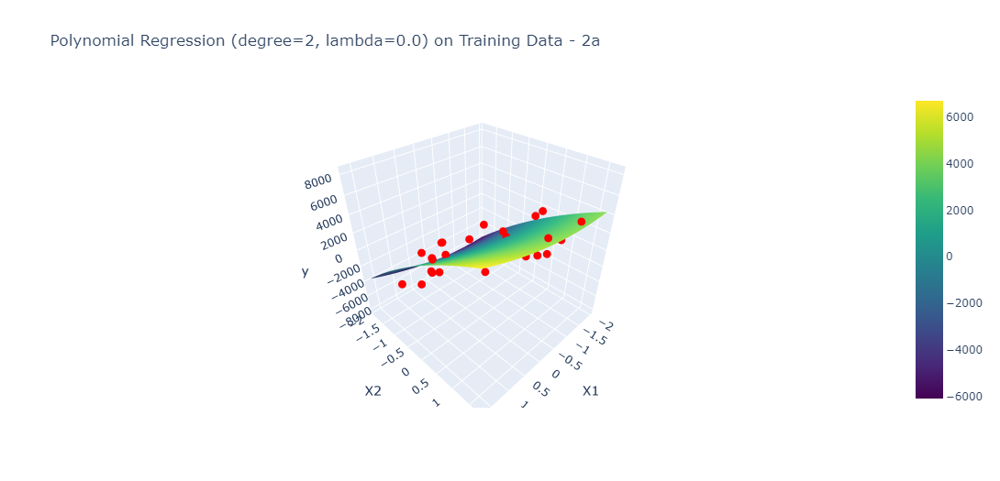
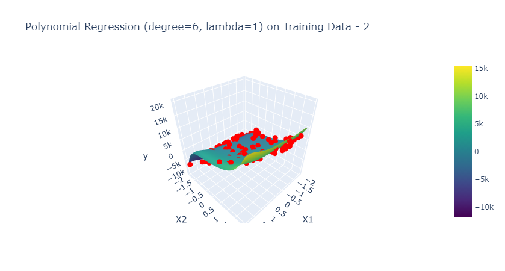

# PRML Assignment 1 (Team 33 )
> Radhe Shyam Salopanthula (ns24z044) & Sshubam Verma (ns24z282)

## Results for Assignment 1

- **Regression Model:** Linear model for regression using polynomial basis functions
- **Regularization method:** Quadratic regularization

### Training Dataset 1(a): 10 examples 
> 1-dimensional (Univariate) input data

#### Without Regularization

##### Observations

1. **Degree 3 without Regularization**: Comparable performance with regularization, slightly better in test MSE.
1. **Degree 6 without Regularization**: Severe overfitting with extremely high MSE values in validation and test.

#### With Regularization

##### Observations

1. **Degree 9 with Regularization (λ = 0.001)**: Lower MSE in training, but higher in test, suggesting some overfitting.
1. **Degree 9 with Regularization (λ = 0.1 and 1)**: Increasing lambda decreases the test MSE, improving generalization.

### Training Dataset 1(b): 50 examples
> 1-dimensional (Univariate) input data

#### Without Regularization

##### Observations

1. **Degree 3 without Regularization**: Slightly worse test performance, but better than some regularized cases.
1. **Degree 6 without Regularization**: Similar performance to Degree 9 with regularization, but slightly less effective.
#### With Regularization

##### Observations

1. **Degree 9 with Regularization (λ = 0.001)**: Good generalization, with slightly better MSE in validation and test than 1a.
1. **Degree 9 with Regularization (λ = 0.1 and 1)**: Increasing lambda results in marginal increases in test MSE.

### Training Dataset 2(a): 25 examples
> 2-dimensional (Bivariate) input data

#### Without Regularization

##### Observations
1. **Degree 2 and 4 without Regularization**: High MSE, showing inability to generalize.

#### With Regularization

##### Observations

1. **Degree 6 with Regularization**: Extremely high MSE values across the board, suggesting poor fit.

### Training Dataset 2(b): 100 examples
> 2-dimensional (Bivariate) input data

#### Without Regularization

##### Observations

1. **Degree 2 and 4 without Regularization**: High MSE, similar poor generalization as in 2a.

#### With Regularization

##### Observations

1. **Degree 6 with Regularization**: Similar to 2a, very high MSE values.

## Dataset 3
> Multivariate data

### Observations

1. **Degree 3 with Regularization**: Stable MSE values across all datasets, suggesting good generalization.
1. **Degree 2 without Regularization**: Significantly lower MSE, showing effective performance without regularization.

## $E_{RMS}$ Table

| Dataset | Degree | λ | Regularization | Training $E_{RMS}$ | Validation $E_{RMS}$ | Test $E_{RMS}$ |
| :------ | -----: | -----: | :------------- | -------------: | ---------------: | ---------: |
| 1a      |      9 |  0.001 | Yes            |       0.280719 |           0.5396 |    0.90606 |
| 1a      |      9 |    0.1 | Yes            |       0.306639 |         0.560843 |   0.662793 |
| 1a      |      9 |      1 | Yes            |       0.350065 |          0.63514 |   0.567244 |
| 1a      |      3 |        | No             |       0.283378 |         0.669069 |   0.578373 |
| 1a      |      6 |        | No             |        0.25371 |          27.7856 |    42.2011 |
| 1b      |      9 |  0.001 | Yes            |       0.338586 |         0.411546 |   0.511182 |
| 1b      |      9 |    0.1 | Yes            |       0.344825 |         0.403183 |   0.513352 |
| 1b      |      9 |      1 | Yes            |       0.352835 |         0.369344 |   0.527465 |
| 1b      |      3 |        | No             |       0.355957 |          0.40061 |   0.508245 |
| 1b      |      6 |        | No             |       0.343583 |          0.41459 |    0.51277 |
| 2a      |      6 |  0.001 | Yes            |        843.572 |          4496.38 |    2427.39 |
| 2a      |      6 |    0.1 | Yes            |        845.591 |           4640.6 |    2476.11 |
| 2a      |      6 |      1 | Yes            |        857.566 |           4729.2 |    2508.36 |
| 2a      |      2 |        | No             |        1593.56 |          6032.11 |    2520.07 |
| 2a      |      4 |        | No             |        849.883 |           4849.5 |    2582.12 |
| 2b      |      6 |  0.001 | Yes            |        1776.35 |          4310.96 |    1861.26 |
| 2b      |      6 |    0.1 | Yes            |        1776.39 |           4316.3 |    1861.48 |
| 2b      |      6 |      1 | Yes            |        1778.32 |          4348.22 |    1862.82 |
| 2b      |      2 |        | No             |        2318.17 |          5335.96 |    2390.16 |
| 2b      |      4 |        | No             |         1819.4 |          4597.95 |    1849.14 |
| 3       |      3 |  1e-06 | Yes            |        5.21479 |          5.17761 |    5.20719 |
| 3       |      3 | 0.0001 | Yes            |        5.21479 |          5.17761 |    5.20719 |
| 3       |      3 |    0.1 | Yes            |        5.21479 |          5.17761 |    5.20719 |
| 3       |      2 |        | No             |        2.24179 |          2.24129 |    2.30676 |

## Best Combinations
Here are the best combinations for each dataset as observed in the report:

1. **Dataset 1(a) - 10 examples, Univariate Input Data:**
   - **Best Combination:** Degree 9 with Regularization (λ = 1)
     - **Reason:** This combination provides the lowest test Mean Squared Error (MSE) while maintaining generalization, making it the best choice.

2. **Dataset 1(b) - 50 examples, Univariate Input Data:**
   - **Best Combination:** Degree 9 with Regularization (λ = 0.001)
     - **Reason:** This configuration shows good generalization and better MSE in validation and test compared to other regularized cases.

3. **Dataset 2(a) - 25 examples, Bivariate Input Data:**
   - **Best Combination:** None of the tested combinations are particularly good, but Degree 2 or 4 without regularization might be the least poor options.
     - **Reason:** High MSE values across the board indicate poor generalization ability, even with regularization.

4. **Dataset 2(b) - 100 examples, Bivariate Input Data:**
   - **Best Combination:** Similar to Dataset 2(a), none of the combinations performed exceptionally well, but lower-degree polynomials without regularization might be marginally better.

5. **Dataset 3 - Multivariate Data:**
   - **Best Combinations:**
     - **Degree 3 with Regularization:** Provides stable MSE values across all datasets, indicating good generalization.
     - **Degree 2 without Regularization:** Shows significantly lower MSE, which suggests effective performance without the need for regularization.
